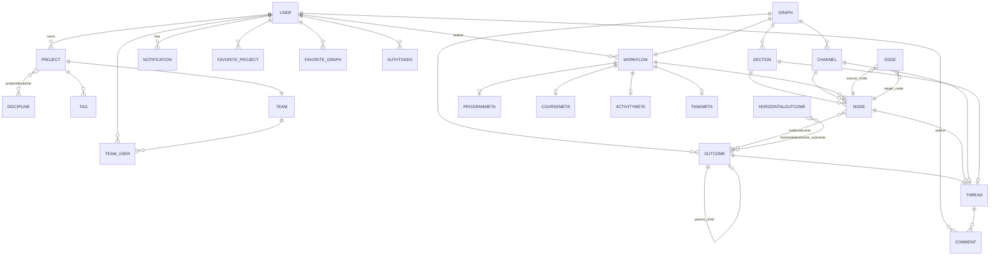

# ERD (derived from `course_flow/core/models`)

This diagram reflects the **current Django models**. Legacy names `UNIT` and favorite-workflow are removed; the academic object is **Workflow**, the projection container is **Graph**.

**Notes**

- `TEAM_USER` is the `TeamUser` model (`cf_team_user`); `TEAM` maps to `Team` (`cf_project_team`).
- `FAVORITE_GRAPH` references a **Graph** row (`cf_favorite_graph`).
- Outcome hierarchy uses a **self-FK** (`parent` / `children`) and `order`, not a separate outcome–outcome join table.
- `Graph` has **no** `Project` foreign key in the current ORM; cross-project scoping for graphs is not expressed in `Graph` itself.
